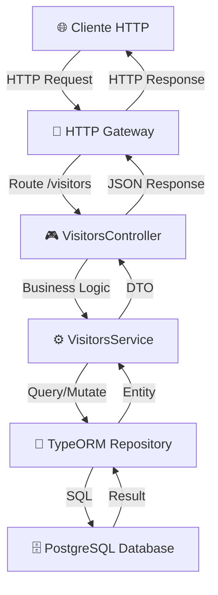
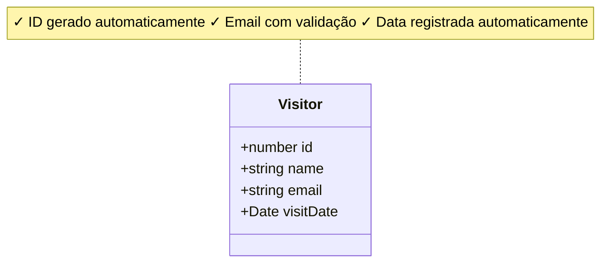
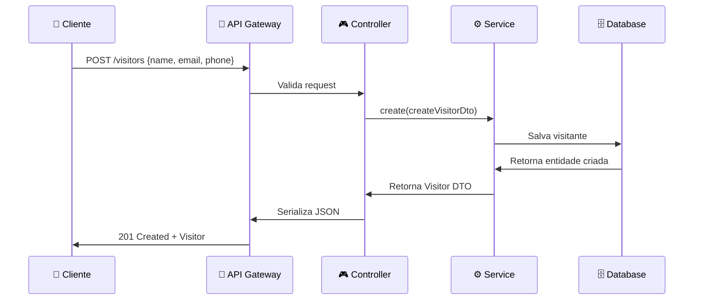
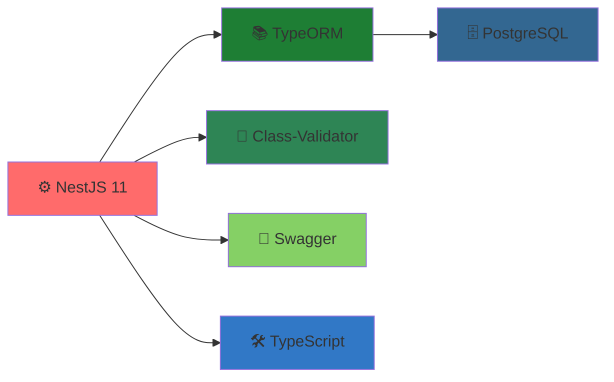

# 📚 Documentação da API de Visitantes

## 🎯 Visão Geral

API RESTful desenvolvida com **NestJS** para gerenciar registros de visitantes. A API fornece operações completas de CRUD (Create, Read, Update, Delete) com validação de dados e documentação automática via Swagger.

---

## 🚀 Como Acessar a Documentação Interativa

**URL:** `http://localhost:3000/swagger`

A documentação interativa permite:
- ✅ Visualizar todos os endpoints disponíveis
- ✅ Testar chamadas em tempo real
- ✅ Ver modelos de requisição e resposta
- ✅ Validar dados antes de enviar

---

## 📊 Arquitetura da API



---

## 🔗 Endpoints Disponíveis

### 1️⃣ Criar Novo Visitante

**`POST /visitors`**

```
POST /visitors HTTP/1.1
Host: localhost:3000
Content-Type: application/json

{
  "name": "João Silva",
  "email": "joao@example.com",
  "phone": "(11) 98765-4321"
}
```

**✅ Resposta (201 Created):**
```json
{
  "id": 1,
  "name": "João Silva",
  "email": "joao@example.com",
  "visitDate": "2026-05-26T12:42:04.000Z"
}
```

**📋 Regras de Validação:**
- `name`: Obrigatório, string, mínimo 3 caracteres
- `email`: Obrigatório, deve ser email válido
- `phone`: Obrigatório, formato: (XX) 9XXXX-XXXX

---

### 2️⃣ Listar Todos os Visitantes

**`GET /visitors`**

```
GET /visitors HTTP/1.1
Host: localhost:3000
```

**✅ Resposta (200 OK):**
```json
[
  {
    "id": 1,
    "name": "João Silva",
    "email": "joao@example.com",
    "visitDate": "2026-05-26T12:42:04.000Z"
  },
  {
    "id": 2,
    "name": "Maria Santos",
    "email": "maria@example.com",
    "visitDate": "2026-05-26T13:15:00.000Z"
  }
]
```

---

### 3️⃣ Obter Visitante por ID

**`GET /visitors/:id`**

```
GET /visitors/1 HTTP/1.1
Host: localhost:3000
```

**✅ Resposta (200 OK):**
```json
{
  "id": 1,
  "name": "João Silva",
  "email": "joao@example.com",
  "visitDate": "2026-05-26T12:42:04.000Z"
}
```

**❌ Erro (404 Not Found):**
```json
{
  "statusCode": 404,
  "message": "Visitante não encontrado"
}
```

---

### 4️⃣ Deletar Visitante

**`DELETE /visitors/:id`**

```
DELETE /visitors/1 HTTP/1.1
Host: localhost:3000
```

**✅ Resposta (200 OK):**
```json
{
  "message": "Visitante deletado com sucesso"
}
```

**❌ Erro (404 Not Found):**
```json
{
  "statusCode": 404,
  "message": "Visitante não encontrado"
}
```

---

## 📦 Modelo de Dados

### Entidade: Visitor



---

## 🔄 Fluxo de Requisição e Resposta



---

## 🛡️ Validações e Regras de Negócio

| Campo | Tipo | Validação | Exemplo |
|-------|------|-----------|---------|
| **name** | string | Obrigatório, 3-255 caracteres | "João Silva" |
| **email** | string | Obrigatório, formato email | "joao@example.com" |
| **phone** | string | Obrigatório, formato telefone | "(11) 98765-4321" |
| **visitDate** | Date | Gerado automaticamente | "2026-05-26T..." |

---

## 🌍 Tratamento de Erros

### Status HTTP Utilizados

| Status | Significado | Exemplo |
|--------|-------------|---------|
| **200** | OK | Requisição bem-sucedida |
| **201** | Created | Recurso criado com sucesso |
| **400** | Bad Request | Dados inválidos |
| **404** | Not Found | Recurso não encontrado |
| **500** | Server Error | Erro interno do servidor |

### Exemplo de Erro de Validação

```json
{
  "statusCode": 400,
  "message": [
    "name deve ser uma string",
    "email deve ser válido"
  ],
  "error": "Bad Request"
}
```

---

## 🔧 Tecnologias Utilizadas



---

## 💡 Exemplos de Uso com cURL

### Criar Visitante
```bash
curl -X POST http://localhost:3000/visitors \
  -H "Content-Type: application/json" \
  -d '{
    "name": "João Silva",
    "email": "joao@example.com",
    "phone": "(11) 98765-4321"
  }'
```

### Listar Todos
```bash
curl -X GET http://localhost:3000/visitors
```

### Obter por ID
```bash
curl -X GET http://localhost:3000/visitors/1
```

### Deletar
```bash
curl -X DELETE http://localhost:3000/visitors/1
```

---

## 🚀 Como Iniciar a API

```bash
# Desenvolvimento
npm run start:dev

# Produção
npm run build
npm run start:prod
```

A API estará disponível em: **https://visitors.up.railway.app/visitors**

Swagger estará disponível em: **https://visitors.up.railway.app/visitors/swagger**

---

## 📝 Notas Importantes

- ✅ O campo `visitDate` é gerado automaticamente no banco de dados
- ✅ Todos os campos de entrada são validados antes de serem salvos
- ✅ O sistema usa transações para garantir consistência dos dados
- ✅ Erros são retornados em formato JSON padronizado

---

**Desenvolvido com ❤️ usando NestJS e TypeScript**
